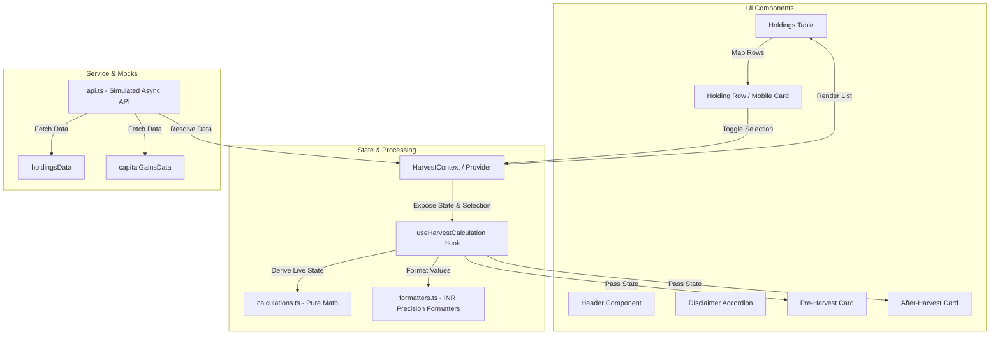

# KoinX — Tax Loss Harvesting Tool

A responsive React application that helps crypto investors optimize their tax liability through tax loss harvesting. Built for the KoinX Frontend Intern Assignment.


---

## 🔗 Live Demo & Deployment

The application is deployed on Vercel:
👉 **[KoinX Tax Loss Harvesting Live Demo](https://koin-x-tax-loss-harvesting-8qxj.vercel.app/)**

---

## 🏗️ Architecture & Component Flow

The app follows a modern architecture with a decoupled data layer, a global context manager, and pure utility functions for math and formatting:



---

## ✨ Features

- **Real-time Tax Harvesting Simulation** — Select/deselect assets in the holdings list to instantly see the updated capital gains and potential tax savings.
- **Side-by-Side Comparison** — Clear visualization showing "Pre-Harvesting" (current gains) next to "After-Harvesting" (optimized preview state) cards.
- **Intelligent Sorting** — Automatic sorting of holdings. Loss-making assets (best candidates for harvesting) are bubbled to the top, followed by absolute short-term gains.
- **Double-Safe Currency Formatting** — Custom currency formatting utility (`formatINR`) designed to completely eliminate `-₹0.00` (negative zero) bugs.
- **Auto-Scaling Decimal Precision** — Clean display for ultra-small values using `toFixed(4)` (e.g., displaying `₹0.0031` instead of cluttered `₹0.003067`).
- **Smooth Transitions & Subtle Glow** — Premium micro-interactions: card hover animations (`hover:scale-[1.002]`), transition fades on calculations, and a subtle glowing container for savings.
- **Sticky Table Header & Blur** — Sticky header in the holdings list with `backdrop-blur-sm` background to maintain spatial awareness when scrolling large datasets.
- **Full Mobile Responsiveness** — Completely separate grid/flex layouts and mobile-tailored cards ensuring no horizontal scrolling or overlapping text on `320px` screens.
- **Skeleton Loading & Error States** — Graceful loading transitions and interactive error states with a retry button for robust UX.
- **Accessible Accordion Disclaimer** — Structured and fully interactive disclaimer accordion for compliance and user awareness.

---

## 🚀 Setup Instructions

### Prerequisites
- Node.js >= 18.0.0
- npm >= 9.0.0

### Installation

1. **Clone the repository:**
   ```bash
   git clone https://github.com/YOUR_USERNAME/koinx-tax-loss-harvesting.git
   cd koinx-tax-loss-harvesting
   ```

2. **Install dependencies:**
   ```bash
   npm install
   ```

3. **Start development server:**
   ```bash
   npm run dev
   ```
   The app will run at `http://localhost:5173`.

### Build for Production

To bundle and preview the optimized build:
```bash
npm run build
npm run preview
```

---

## 🧮 Calculations & Core Logic

### Harvesting Algorithm

When an asset is selected for harvesting, we simulate selling its balance to realise the gains/losses:
- If a holding has **short-term gains > 0** → it increases `stcg.profits`
- If a holding has **short-term gains < 0** → its absolute value increases `stcg.losses`
- The same rule applies for **long-term gains** (`ltcg.profits` and `ltcg.losses`)

```
Net Short-Term = stcg.profits - stcg.losses
Net Long-Term  = ltcg.profits - ltcg.losses
Realised Gains = Net Short-Term + Net Long-Term
```

### Savings Evaluation
```
Tax Savings = Pre-Harvest Realised Gains - After-Harvest Realised Gains
```
The **Savings Banner** is displayed only when `Tax Savings > 0`. If a profitable asset is selected (increasing gains), a warning notification is displayed informing the user of the tax impact.

---

## 🎨 Design Tokens

Our custom UI colors are fully matched to Figma templates in `tailwind.config.js`:

| Token | Value | Description |
|-------|-------|-------------|
| `kx-dark` | `#0D1321` | Page Body background |
| `kx-darker` | `#060D1A` | Header / Navigation background |
| `kx-card` | `#0F1923` | Card backgrounds |
| `kx-border` | `#1E293B` | Structural dividers & borders |
| `kx-blue` | `#3B82F6` | Primary accents & active selections |
| `kx-green` | `#22C55E` | Positive gains and success states |
| `kx-red` | `#EF4444` | Losses and alert states |

---

## 📱 Responsiveness Matrix

| Screen Size | Breakpoint | Component Behavior |
|-------------|------------|--------------------|
| Mobile | `< 768px` | 1-column layout, mobile card views, pagination, collapsible disclaimer |
| Tablet | `768px - 1024px` | 2-column gains cards, horizontal scrollable holding table |
| Desktop | `> 1024px` | Full side-by-side dashboard layout, multi-column holding table with hover effects |

---

## 📄 License

MIT — Created for KoinX Frontend Intern Assignment.
